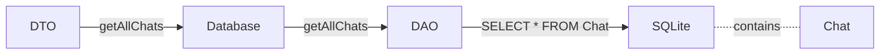
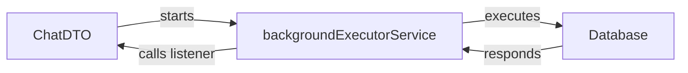

from pathlib import Path

content = """# Documentation of My App Extension

## Foreword
During my studies in Applied Computer Science at the University of Applied Sciences for Business (FHDW) in Bergisch Gladbach, an Android app was implemented for learning purposes as part of the “App Project” module in the 3rd semester under the supervision of Dr. Christian Soltenborn. This app, which was developed together during the module, is now to be extended with a self-chosen functionality as part of a project. This extension is part of the module’s assessment.

## Introduction
### Current State

The provided app already allows recording messages via Android’s speech input, converting them, sending them correctly to the ChatGPT (OpenAI) API, and receiving, displaying, and reading out its response. Speech input and subsequent communication are initiated using the “Fragen”/“Ask” button. App settings have also been implemented (top right), where the user can enter their API key. This is mandatory, otherwise the app cannot connect to the GPT interface.

### Identified Problems in the Current State
The following issues with the provided app were identified:

1. The user’s question is always read aloud / there is no button to pause the process.

2. The user cannot look up older responses because the text area is limited by the device’s screen size and does not provide scrolling functionality.

3. There is no way to delete previous messages to change the conversation context.
   - The user can only have one conversation with ChatGPT at a time.

4. The user cannot create new chats or retrieve them.

5. The conversation history is not persisted / the conversation is not saved and therefore cannot be viewed at a later time. If the user restarts the app, all messages are lost.

6. Application errors are not caught and lead to the app crashing. The user does not learn what happened and is confronted with the app closing abruptly (poor user experience).

7. The app is aesthetically limited.

### Target State
After clearly identifying and defining seven problems, the following solutions for points 1–7 are planned as part of my extension to the app:

1. Implement a “Pause/Stop” button to cancel the read‑aloud response.

2. Add scrolling capability to the presentation area (TextView) so older messages can be reviewed.

3. Implement a “Delete” button to clear the current conversation and automatically create a new empty one.

4. Add a dropdown list to present different chats. The messages of the currently selected conversation from the list will be displayed in the presentation area.
   - The different conversations should be clearly identifiable in the dropdown list using date and time.

5. Integrate Android’s Room database to serialize and persist conversations (chats) within the app.

6. Implement basic error handling (try/catch) to catch application errors, and add a new, smaller presentation area below the existing one to visualize caught errors.

7. To improve aesthetics, add a background image behind the presentation area, incorporate appropriate icons for planned and existing buttons, implement margins and minimum sizes for portrait orientation, and set the error box text color to red.

In the image on the right, the places where the new GUI elements will be placed are highlighted in red. At the very top, the new dropdown list will be implemented, directly below it the existing presentation area. Below that, the new error box will display runtime errors. At the bottom edge of the screen are four buttons: “Delete”, “Add”, “Pause”, and “Ask”. Ideally, all elements should maintain identical margins to the screen edges.

## Implementation

Before integrating my extensions into the given app, I drafted the following action plan to implement efficiently:

Implementation of …
1. … the **Delete** button.
2. … the **error box** and associated **error handling**.
3. … **scrollability** of the TextView.
4. … the **Room** database for data persistence and its **interface**.
5. … any necessary **adjustments** to existing classes.
6. … the **dropdown list** including database binding.
7. … the **New** and **Pause** buttons and their logic.
8. … **constraints** for positioning the **GUI elements**.
9. … and then **testing** the interplay of the extensions as well as **handling** any **errors** encountered.
10. … a **background image**.
11. … various **icons** to refine the GUI.

Even though I had to change this list often, it provided a framework to guide me. The factors that changed this framework are discussed in the next section (*Problems During Development*).

Let’s move on to implementing my extensions.

### Environment
First, I created this branch named “appExtension” in my repository “app_entwicklung_BFAX422A” according to the specification. I then set up Android Studio on my home PC and connected it with my laptop. I also enabled Developer Mode on my smartphone to live‑test my development progress. This was particularly helpful to assess what the app still lacked and whether my extensions provided the desired benefits.

### Redesign of the Graphical User Interface
The GUI of my Android application was fundamentally revised, although I oriented the positioning of the new elements around the existing app from the lectures and reused existing UI components. The following changes and additions were made:

#### 1. Revision of the Given Presentation Area (*TextView*)

As noted in the problem analysis, the user cannot review older messages. To enable this, the existing presentation area, which is included via XML using a *TextView*, must be able to make text available even if it doesn’t fit into the visible area. This is achieved with *scrollability*. This property allows the text within the bounds of the area to be scrolled up and down using a small bar at the edge. In this way, text that previously could not be displayed becomes accessible.

To give the *TextView* this functionality, the *MovementMethod* property on the *TextView* object must be set to an instance of `ScrollingMovementMethod`. In code, this looks like this:
  

  
The result appears next to the text as follows:  

  
As you can see, a scroll bar is automatically added to the right of the text and opens automatically upon interaction.
  

#### 2. A New Background Image

To avoid filling the screen only with messages and buttons and to bring some dynamism to the app, I decided to add a background image. After careful consideration, I opted not to use a custom picture (e.g., a robot), but to reuse the app’s existing logo. This not only saves a small amount of memory, but also guides the user thematically through consistent elements, improving the app’s overall impression.

The background image is centered vertically and horizontally on the device, depending on the available screen size. Note that the image always maintains a minimum padding of 50dp (see bottom right ↘️ for a better sense of this size).

In addition to positioning, properties such as *android:scaleType* and *android:alpha* were set. The *android:alpha* property represents the transparency behavior of the background image. It describes how the color values of the graphic element are multiplied with those of the actual background color. If this value— as in my case— is chosen to be less than 1, the image becomes grayer. This ensures the image subtly blends into the background.
  

> [!NOTE]
> The table screenshot below was taken from “http://labs.rampinteractive.co.uk/android_dp_px_calculator/” on November 18, 2023 at 13:20 with the input parameter *50dp*.

 

#### 3. Three New Buttons

As indicated in my extension plan, three new buttons were added: “Delete”, “New”, and “Pause”. The existing “Ask” button was retained. After initially adding the three new buttons to the GUI as simple `Button` elements with text, I decided— as anticipated— to use icons. Therefore, it was necessary to change the `Button` elements to `ImageButton` elements.

I researched many different icons and limited my selection to those with the *Creative Commons Zero* license, since they are explicitly permitted for free commercial use on the web. I chose the following four icons to make the buttons easily recognizable: 

| Button                  | *Delete*  | *New*  | *Pause*   | *Ask*   |
|-------------------------|-----------|--------|-----------|---------|
| Icon used               |||||

 

> [!NOTE]
> The icons all come from “https://iconduck.com/licenses/cc0” and are explicitly marked with the *Creative Commons Zero* license.

 
After placing the selected icons on the buttons, I found that the marking still wasn’t sufficient to make them stand out as buttons. I decided to add a gray circular background behind each button to make them stand out from the app’s layout. To achieve this, the `android:background` property was set to a newly created gray circle shape. I added and implemented this gray circle as an XML file in the app’s `res/drawable` folder.
  

> [!NOTE]
> There are several ways in Android XML to display a gray circle. I used a `<shape>` with HEX color `#d1d1d1` and a radius of 40dp.  
> 

After defining the corresponding icons and a gray circular background, I adjusted the existing elements accordingly. I defined the following positional constraints for the four elements: 
1. Each element maintains the same margin to the presentation area above as to the lower screen edge (thus vertically centered).
2. All elements reference their closest neighboring element laterally. If an element is on the outside, it references the screen edge horizontally.
3. Elements on the outside maintain a horizontal margin of 32dp.
4. Inner elements maintain a horizontal margin of 32dp to other inner elements and 0dp to outer elements. 
This results in the following dependencies:  

   
The final GUI with the implemented buttons looks like this:
  

  

## 4. A New Error Box

Next, I implemented a new error box with another `TextView`. For a consistent look, I applied similar constraints as for the other elements. The key properties of the `errorTextView` are:

- Text color set to red (`#d11507`) via `android:textColor`.
- Horizontal margin of **32dp**.
- Vertical margin above of **24dp** (no dependency below).

The error box sits below the presentation area and above the buttons, as planned.

Here’s the GUI with the new error box:

 

---

## 5. A New Dropdown List

Finally, I added a dropdown list to the GUI. There are many ways to implement a dropdown in Android XML. After some research and issues (see _Problems During Development_), I chose a **Spinner**. A spinner consists of three essential parts:

1. A definition of how the currently selected item is shown and how interaction opens the list,
2. a definition of what a list item looks like,
3. and an `ArrayAdapter` that provides the items from code.

Below are images for all three parts to implement a working spinner:

> [!IMPORTANT]
> **Spinner definition in XML**  
> 

> [!IMPORTANT]
> **List item definition**  
> 

> [!IMPORTANT]
> **ArrayAdapter setup in app logic**  
> 

As you can see, everything comes together here. We create and assign a new adapter to the Spinner with three parameters:

- the current activity context,
- the layout for a single list item,
- a generic list of type `Chat` which serves as the data source for the spinner.

**Positioning constraints:**

- The spinner is horizontally centered and expands with a **32dp** side margin.
- Vertically, it sits at the top **3%** of the screen height.

The final app view with the spinner:

 

> [!TIP]
> To see the interface in action, see the conclusion.

---

## Database Implementation

Since, as defined in the solution approach, multiple conversations with ChatGPT must be persisted beyond app runtime, we need a storage form supported by Android. After brief research and consultation with Dr. Soltenborn, I decided to use Android’s recommended **Room** interface over SQLite. Room sits as a layer on top of SQLite and simplifies access.

> [!IMPORTANT]
> To properly implement and use this database interface, the following dependencies must be added to the `*.gradle*` file:  
> 

### The Database

To persist the list of `Chat` instances stored in the `MainFragment`, we create a **Chat** entity representing a relational table in SQLite. To access this table (insert, read), we use a **DAO** (Data Access Object) to execute SQL commands. Since the DAO’s return format isn’t directly what I want to use in the app, I added a **DTO** (Data Transfer Object) that queries via the DAO and converts the results into app-ready structures. This does not happen directly in the DAO but via an additional **Database** class that holds the DAO. The flow is:

I created a new folder `roomDB` in the project for these elements. It contains:

- **Chat** (entity)  
- **AppDatabase** (database)  
- **ChatDAO** (data access object)  
- **ChatDTO** (data transfer object)  

Below is a brief overview of the entity, the DAO, and the database:

- **Chat entity:**  
  

- **DAO interface:**  
  

- **Database:**  
  

Details on the DTO, which serves as the active interface between the app and the database, follow next.

---

## Connecting the Database to App Logic via the DTO

The DTO is implemented as a class in `roomDB`. It follows the **Singleton** pattern and holds a static instance of `AppDatabase`. All DB access goes through this object. The class exposes the following public methods:

| Method                                         | Function |
|-----------------------------------------------|----------|
| `void getAllChats(OnChatsLoadedListener listener)` | Queries all records of the `Chat` table and converts stored data (e.g., JSON strings) into directly usable objects. These are then delivered to the provided listener. On error, the listener’s error method is called. |
| `Object saveAllChats(List<Chat> chatsToSave)`  | Accepts a generic list of `Chat`, transforms it into a list of records, and inserts them into the `Chat` table. |

> **Warning**  
> The DTO methods use a **backgroundExecutorService**, i.e., a background thread that executes database operations so the UI thread remains responsive even if a DB task takes longer.

---

## Error Handling Implementation

To add basic error handling, we first identify areas in the logic where errors may occur unexpectedly. Detailing the entire app’s error handling would be too extensive here, so I’ll illustrate it using the `ChatDTO`, the database transfer object.

### Error Source: Database

Because the actual DB query is delegated via **Room** to **SQLite**, an invalid query (if not caught by Room) can produce an error in SQLite’s DBMS. This error is caught there and forwarded to Room, which then forwards it to the DAO and, indirectly, to the DTO (see the dependency chain under **The Database**).

### Error Handling in the DTO

The DTO starts, as described earlier, a new background process to handle DB operations. This process receives logic via an anonymous function. Since we identified DB operations as a potential error source, the error ends up at the end of the chain in this background process—so we must catch and process it there.

Consider the public method `getAllChats()`. It receives a `listener` object whose type implements the `OnChatsLoadedListener` interface.

> **Note**  
> This interface provides two essential functions: `onChatsLoaded()` and `onError()`. Both must be implemented.

This listener is provided to handle the background process’s result once finished. Conceptually:

Thus, the result of the background process is reported back to the main thread. Since we don’t know whether the response is valid or an error, we must handle errors in the background process using `try–catch`. If an error occurs, we forward it to the main thread by calling `onError()` on the listener:

In the main thread, we then catch it where the DTO is instructed to perform a DB operation—in my case, in `onViewCreated()` of `MainFragment`. Each time the UI is created, the DTO is asked to load all saved chats via `getAllChats()`. In my code, this call is at **line 175** in `MainFragment`:

We wrap this call in a `try–catch` and, to ensure the message appears in the error box, implement the `catch` like this:

The `setErrorMessage()` method writes the provided error message into the error box.

---

## Problems During Development

Although the initial plan provided solid guidance, I had to reorder the steps multiple times. The actual sequence needed to achieve the planned extensions was:

1. “Delete” and “New” buttons  
2. Dropdown list  
3. Error box and basic error handling  
4. Room database and Chat entity  
5. DAO and DTO  
6. Extended error handling  
7. Refactoring DB access / using a “background executor service”  
8. Spinner error handling  
9. Refactoring the DTO  
10. Debugging and fixes (device rotation and loading saved state)  
11. “Pause” button  
12. Testing all changes and final cleanup

A complete deep dive into every issue is beyond this document’s scope. Below are the key ones.

### The Dropdown List Dilemma

Early on, after implementing the “Delete” button, I researched Android dropdowns. I underestimated their complexity and initially tried a `TextInputLayout` with an `AutoCompleteTextView`. I had most of it implemented when I realized I needed a specific style. After hours without productive progress, I abandoned this approach (fortunately) and switched to a **Spinner**, which was much simpler to implement.

> **Take-home message:** If you’re inexperienced in an area and something still doesn’t work after many attempts, look for an alternative before wasting more time.

### The Database Connection Issue

After reading the Room docs and watching an explainer video, I started development—only to struggle adding the required Gradle dependencies. Once I managed to import a minimal Room setup, I built my DB and interface. Testing revealed Android discourages DB operations on the UI thread. After brief research on how others solved this, I moved to a **multi-threaded** approach.

> **Take-home message:** No matter how prepared you think you are, something will go off plan. Don’t over-research; once you grasp the concept, try it out.

### I Rotate My Device and… the Database Breaks!

Near the end, I tested thoroughly. Everything worked—until I rotated the device. Each rotation duplicated chat entries in the spinner. Inspecting the DB (with a tool recommended by Dr. Soltenborn) showed saves occurred not only on app close but also on **configuration changes** (i.e., rotation). A configuration change restarts the current activity; the UI is recreated each time. On app close, all chats in the spinner are saved, including duplicates—much to the database’s displeasure.

> **Take-home message:** If your program will be integrated into an existing system or lifecycle, learn that lifecycle first.

---

## Project Conclusion

### Implementation

Although it was a long journey, I’m proud to present my completed, extended Android application. All initially defined issues were resolved or transformed and then solved. Users can now (with a valid API key) maintain multiple conversations with ChatGPT. These are persisted across sessions and reloaded on startup. If a conversation’s message history exceeds the presentation area, users can scroll to view older messages.

Visually, the app is significantly improved: a background image adds dynamism, separating text from background; existing and new buttons have matching icons and backgrounds for a cohesive look. Finally, the new error box and pause button work well. If no error occurs, the user won’t notice the error box. If something goes wrong, the app doesn’t crash; instead, the user sees that something hasn’t worked as expected, emphasized by the error box’s red text.

### Personal Conclusion

I learned a lot from this app project, but it was challenging to juggle everything time-wise. With significant study workload, presentations in almost every subject, additional research, and onboarding into the program, I seriously underestimated the time investment—especially the final documentation of my extension, which was more time-consuming than expected.  
Would I recommend the project? Absolutely — it was fun.
